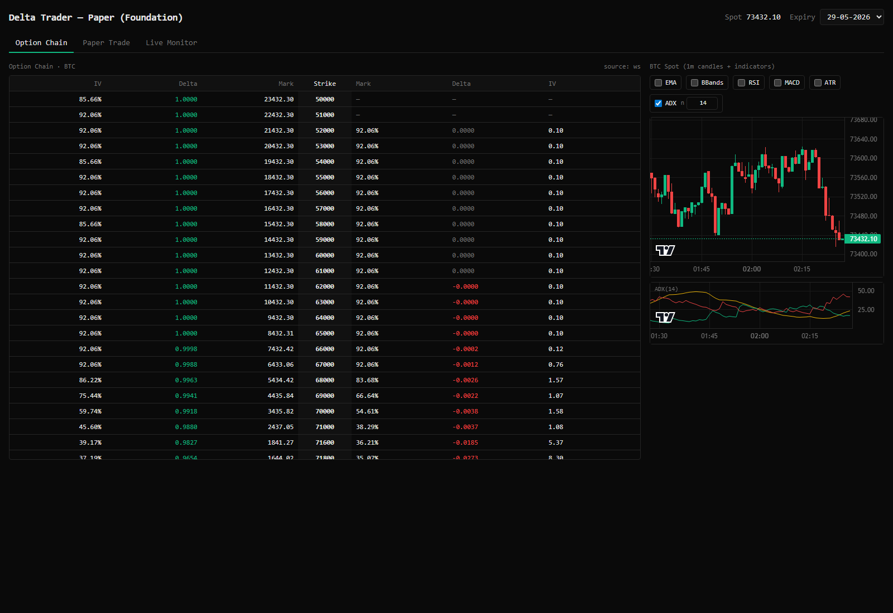

# Delta Trader

A self-hosted trading platform for **Delta Exchange India** BTC options — paper
trading, live monitoring with a whole-strategy stop-loss, realtime MTM/Greeks/IV/RV,
and technical indicators. Runs on a single $0 Oracle Cloud Always-Free VM.



## What it does
- **Option Chain** — live BTC option chain (greeks + IV) and a candlestick spot chart
  with toggleable indicators (EMA, RSI, MACD, Bollinger, ATR, **ADX(14)** by default).
- **Paper Trade** — build a multi-leg strategy, preview fills/margin/greeks, execute
  against the live L2 orderbook with an orderbook-walk + linear-impact slippage model,
  then watch per-second MTM, PnL chart, net Greeks, strategy IV, and underlying RV.
- **Live Monitor** (read-only by default) — your real Delta positions, user-grouped
  strategies, and a double-gated **whole-strategy stop-loss** that market-closes all
  legs when aggregated MTM breaches a threshold.

Per-second state lives in Redis; per-minute aggregates persist to TimescaleDB. Money
is `Decimal` end-to-end, serialized as strings on the wire.

## Stack
Python 3.11 / FastAPI / asyncpg / websockets · React 18 + TypeScript + Vite +
Tailwind + Lightweight-Charts + Recharts + TanStack Query + Zustand · Postgres 16 +
TimescaleDB · Redis · Docker Compose · Caddy (prod TLS).

## Quick start (local)
```bash
cp .env.example .env            # fill in values; keys only needed for live (testnet first)
cd infra && docker compose up -d --build
# open http://localhost:5173   (backend health: curl http://localhost:8000/health/deep)
```
Backend host port defaults to 8000; this repo's dev runs used `BACKEND_PORT=8001`.

## Development
- Branches off `develop`; `main` is release-only. Conventional commits; pre-commit
  hooks run ruff + mypy (backend) and eslint + tsc (frontend).
- Backend gate: `cd backend && uv run --no-sync ruff check . && uv run --no-sync mypy app/ && uv run --no-sync pytest -q`
- Frontend gate: `cd frontend && pnpm lint && pnpm typecheck && pnpm test && pnpm test:e2e`

## Safety (real money)
Section 2 ships **read-only**. The stop-loss is the only write path and is double-gated:
`LIVE_TRADING_ENABLED=true` **and** a per-request `confirm=true`. Validate on Delta
**testnet** first — see `docs/RUNBOOK_LIVE.md`. API keys are never logged. An optional
`API_BEARER_TOKEN` gates the whole API in production.

## Deploy
`docs/DEPLOY_ORACLE.md` — single Oracle Always-Free VM, Caddy TLS, systemd, nightly
`pg_dump` (`docs/RUNBOOK_BACKUPS.md`), optional Prometheus + Grafana.

## Docs
`docs/DECISIONS/` (ADRs 0001–0006) · `docs/ARCHITECTURE.md` · `docs/API.md` ·
`docs/INDICATORS.md` · `docs/DELTA_INTEGRATION.md` · `SECURITY.md`.

## License
MIT — see [LICENSE](LICENSE).
