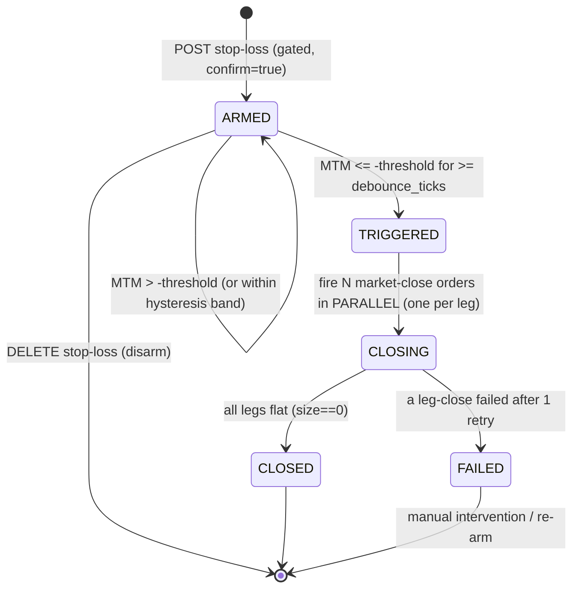
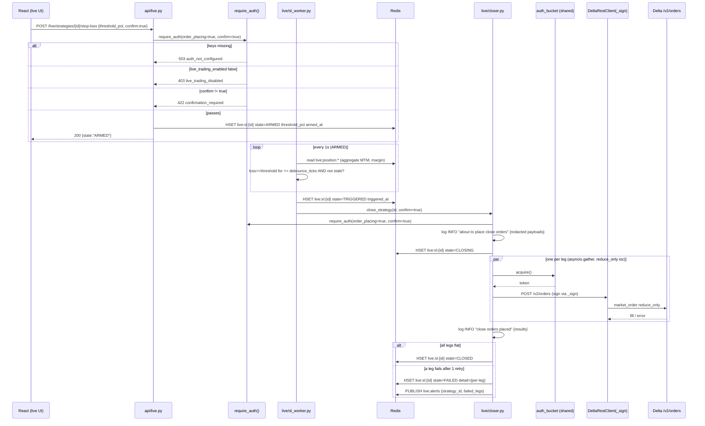

# 0004 — Phase 3 live monitor (Section 2)

- **Status**: Accepted
- **Date**: 2026-05-28
- **Deciders**: Project owner, staff architect / quant

## Context
Phase 3 builds **Section 2 (Live Monitor)** — the first phase that touches **real
money** on a **real Delta Exchange India account**. It reads the user's live
positions and open orders, tracks them with the same per-second-Redis /
per-minute-Timescale MTM cadence as paper trading, lets the user **tag** positions
into named strategies, computes aggregated MTM / Greeks / IV / RV by **reusing the
`quant/` primitives** from ADR 0003, and — the **only** write path in the entire
system — arms a **whole-strategy stop-loss** that fires market-close orders when
aggregated MTM breaches a threshold.

This ADR is written in **PARANOID mode**. The default posture is **read +
monitor only**. There is exactly **one** place that can place or cancel orders
(`live/closer.py`), reached only through one gate, and every order-placing path is
**double-gated**: `settings.live_trading_enabled` **AND** an explicit per-request
`confirm=true`. Money is `Decimal` end-to-end and **strings on the wire**; keys
are read from settings/`.env` and are **never logged, never serialized**.

Hard constraints inherited from `CLAUDE.md` and ADRs 0002/0003:
- **Rule #2** — no code path hitting Delta's private POST/DELETE endpoints runs
  without checking `settings.live_trading_enabled` and logging the intent at INFO
  **before** sending.
- **Rule #3** — money is `Decimal`; never `float`.
- **Rule #4** — per-second display via Redis, per-minute persistence via Postgres.
- **Rule #6** — every Delta WS consumer reconnects and resubscribes.

We reuse the spine verbatim: the Phase 1 `_sign` HMAC scheme and `DeltaRestClient`
(`get_positions` → `/v2/positions/margined`, `get_open_orders` → `/v2/orders`,
already `auth=True`-gated), the single-shared-WS reconnect state machine in
`delta_ws.py`, the minute-buffer-then-COPY-upsert flush from `paper/mtm_worker.py`,
the `quant/` math (`pnl.py`, `greeks.py`, `iv.py`, `rv.py`), the Redis-polling WS
hub in `api/stream.py`, and the `latest:{symbol}` mark hashes for live MTM.

## Decision

### 1. Auth model & the single gate

**Decision: one `require_auth()` gate** in `live/auth_gate.py` that *every*
authenticated path (REST and the auth-WS bootstrap) funnels through. There is no
second way to reach a private Delta call. The gate is a FastAPI dependency for the
API layer and a plain callable for workers.

```python
# live/auth_gate.py
from app.core.config import settings

class AuthGateError(Exception):
    def __init__(self, http_status: int, code: str, detail: str) -> None:
        self.http_status, self.code, self.detail = http_status, code, detail

def require_auth(*, order_placing: bool = False, confirm: bool | None = None) -> None:
    """The SINGLE gate. Read-auth needs (a); order-placing additionally needs (b)+(c)."""
    # (a) keys present — applies to ALL authenticated calls (read or write)
    if not settings.delta_api_key or not settings.delta_api_secret:
        raise AuthGateError(503, "auth_not_configured", "auth not configured")
    if order_placing:
        # (b) global live switch
        if not settings.live_trading_enabled:
            raise AuthGateError(403, "live_trading_disabled",
                                "live_trading_enabled is false")
        # (c) per-request explicit confirmation
        if confirm is not True:
            raise AuthGateError(422, "confirmation_required",
                                "confirm=true required to place/cancel orders")
```

**The three checks, and their failure codes:**

| Check | Applies to | Missing → |
|---|---|---|
| (a) `delta_api_key` **and** `delta_api_secret` present | every authenticated call (read **and** write) | **HTTP 503** `auth_not_configured` |
| (b) `settings.live_trading_enabled` is `True` | order-placing / cancel paths only | **HTTP 403** `live_trading_disabled` |
| (c) per-request `confirm == True` | order-placing / cancel paths only | **HTTP 422** `confirmation_required` |

Read-only auth endpoints (`get_positions`, `get_open_orders`, auth-WS subscribe)
pass `order_placing=False` and so require only (a). The Phase 1 `_request(auth=True)`
already enforces (a)+(b) at the client layer; the gate makes the rule explicit,
testable, and adds (c) at the API boundary so the **double-gate** is enforced
*before* any payload is even built (§7).

**Key redaction.** `delta_api_key`/`delta_api_secret` live only in `settings`
(from `.env`). They are **never** put in a log line, a pydantic model that gets
serialized, a Redis value, a DB row, or an exception message. We add a
`__repr__`/`model_dump` override note: settings dumps must redact these two fields
(`SecretStr` for both, rendered as `"**redacted**"`). The `_sign` helper takes the
secret as a parameter and never logs it (Phase 1 already logs only `method, path`).

**One shared token bucket throttles ALL auth calls.** A single process-wide async
token bucket (`live/rate_limit.py`) sits in front of every authenticated REST call
*and* the auth-WS auth/subscribe sends. Default **10 tokens/s, burst 10**
(configurable `delta_auth_rate_per_sec`, `delta_auth_burst`). It is the *same*
bucket for reads, SL closes, and cancels — so a burst of leg-closes cannot starve a
position sync and vice-versa, and we stay under Delta's ~10 req/s account limit
(skill). Exhaustion behavior:

- **Internal callers** (workers/closer): `await bucket.acquire()` — they block
  (with a cap) rather than hammer Delta.
- **API-driven calls**: if a token cannot be acquired within `bucket_wait_max`
  (default 1 s), the endpoint returns **HTTP 429** with a `Retry-After` header set
  to the bucket's seconds-to-next-token.

```python
# live/rate_limit.py — one module-level singleton
class TokenBucket:
    def __init__(self, rate: float, burst: int) -> None: ...
    async def acquire(self, timeout: float | None = None) -> bool: ...  # False on timeout
    def retry_after(self) -> float: ...                                  # seconds to next token

auth_bucket = TokenBucket(settings.delta_auth_rate_per_sec, settings.delta_auth_burst)
```

`DeltaRestClient` gains an injected `bucket`; `_request(auth=True)` does
`if not await self._bucket.acquire(timeout): raise RateLimited(retry_after)` before
signing. The public Phase 1 token bucket (REST bootstrap) is **separate** — auth
and public limits are accounted independently per Delta.

### 2. Authenticated WS (`live/auth_ws.py`)

Delta requires a **signed auth message** before a connection may subscribe to the
private channels `positions`, `orders`, `fills`. `AuthWSClient` **reuses the Phase
1 reconnect state machine** (exponential backoff + jitter, resubscribe-all, never
silently drop — `delta_ws.py`) and adds an **auth step that must succeed before
resubscribe**.

**Auth payload shape** (HMAC-SHA256 via the Phase 1 `_sign`, over the documented
WS signing string `"GET" + timestamp + "/live"`):

```python
ts = str(int(time.time()))
signature = _sign(secret, "GET", ts, "/live", "", "")   # method+ts+path+query+body
auth_frame = {
  "type": "auth",
  "payload": {"api-key": api_key, "signature": signature, "timestamp": ts},
}
```

**Subscribe flow (per connect):**
1. `require_auth(order_placing=False)` (keys present) — else do not connect, log + alert.
2. `await auth_bucket.acquire()` then `send(auth_frame)`; await `{"type":"success","message":"authenticated"}`.
3. On auth success → send the private subscribe payload (same `{"type":"subscribe","payload":{"channels":[...]}}` shape as Phase 1):
   ```json
   {"type":"subscribe","payload":{"channels":[
     {"name":"positions"},{"name":"orders"},{"name":"fills"}]}}
   ```
4. On `{"type":"error"}` to the auth frame → **do not** subscribe; transition the
   connection to `AUTH_REJECTED`, emit a `live_sl_events`/log alert, back off and
   retry (keys may be wrong/expired). Never retry-spam: cap at backoff 30 s.

**Reconnect → re-auth → resubscribe.** The reconnect loop is the Phase 1 loop with
one inserted state: `CONNECT → AUTH → SUBSCRIBE → READ`. After any drop the client
**re-auths first**, then resubscribes the full private-channel set from its
desired-sub source of truth. The server never remembers auth or subs.

**Normalized frames → Redis.** Incoming private frames are normalized (Decimals
from strings, drop heartbeats) and published to `dxauth:{channel}` pub/sub:
`dxauth:positions`, `dxauth:orders`, `dxauth:fills`. These mirror the Phase 1
`dx:*` channels but are the **private** stream; consumers are `position_sync` and
`order_sync` (§3). Raw frames are **never** logged (they can carry account data).

### 3. Position & order sync (`position_sync.py`, `order_sync.py`)

**Startup bootstrap, then live-merge.** On boot (and on every auth-WS reconnect to
heal gaps):
- `position_sync` GETs `/v2/positions/margined` (`DeltaRestClient.get_positions`).
- `order_sync` GETs `/v2/orders?state=open` (`DeltaRestClient.get_open_orders`).

Both then **live-merge** deltas from `dxauth:positions` / `dxauth:orders` /
`dxauth:fills`. Canonical state lives **in memory + Redis** (memory is the hot
read; Redis is the cross-process / restart-survivable mirror and the WS-hub source).

**Normalized position shape** (`live/models.py`, frozen pydantic, all money `Decimal`):

```python
class LivePosition(BaseModel):
    symbol: str               # "C-BTC-90000-310125"
    product_id: int           # integer key, needed for cancel/close payloads
    size: Decimal             # SIGNED contracts (+long / −short)
    entry_price: Decimal      # avg entry (Delta: entry_price)
    mark_price: Decimal       # from latest:{symbol} (live) or position payload fallback
    margin: Decimal           # Delta: margin (initial margin held)
    unrealized_pnl: Decimal   # Delta: unrealized_pnl (cross-checked vs our MTM)
    contract_size: Decimal    # from products.contract_size (ADR 0003 addendum)
    updated_at: datetime
```

`size` is **signed** (Delta returns signed size on `/v2/positions/margined`); a
short carries negative size, consistent with the ADR 0003 sign convention so the
`quant/` math is reused without translation.

**Redis keys (live):**

| Key | Type | Purpose | TTL |
|---|---|---|---|
| `live:position:{symbol}` | hash | normalized `LivePosition` fields (Decimal-strings) | 120 s, refreshed each sync/merge |
| `live:order:{id}` | hash | normalized open order (id, product_id, side, size, state, limit_price) | 120 s |
| `idx:live:positions` | set | all symbols with a live position (fan-out / WS hub source) | none |
| `idx:live:orders` | set | all open order ids | none |
| `dxauth:positions` / `dxauth:orders` / `dxauth:fills` | pub/sub | normalized private streams (§2) | — |

A position going flat (`size == 0`) removes its hash + set member and writes a
`live_sl_events`-adjacent log. The hubs poll `live:position:*` exactly like the
Phase 1 `latest:*` polling (§9).

### 4. Strategy grouping — user-driven, NO auto-cluster

**Decision: strategies are explicit, user-tagged.** There is **no** automatic
clustering / correlation heuristic. The user POSTs a name + the set of position
symbols (or `product_id`s) to tag them into a named strategy. Rationale: an
auto-clusterer that silently regroups *real-money* positions can arm a stop-loss
over the wrong basket — unacceptable in PARANOID mode. The user owns the grouping.

A position may belong to **at most one** strategy at a time (unique constraint), so
a single SL worker has unambiguous ownership of each leg.

DDL: `live_strategies` (id, name, created_at) + `live_strategy_positions`
(strategy_id, symbol, product_id) — see §8. Aggregated MTM / net Greeks / strategy
IV / underlying RV are computed **over the tagged positions** by reusing
`quant/pnl.py::unrealized_pnl`, `greeks.py::net_signed_greeks`, `iv.py::strategy_iv`,
`rv.py::historical_rv`/`intraday_rv` — the same `LegView` adapter the paper engine
uses, fed from `LivePosition` rows (signed `size`, `entry_price`, live `mark_price`,
`contract_size`). No new math.

### 5. Whole-strategy stop-loss state machine

A **per-ARMED-strategy worker** watches aggregated MTM. **State persisted in
Redis** so a kill + restart **resumes** monitoring/closing — the worker is
stateless; Redis is the source of truth.

**States:** `ARMED → TRIGGERED → CLOSING → CLOSED | FAILED`.



**Redis state** — `live:sl:{strategy_id}` (hash):

| Field | Meaning |
|---|---|
| `state` | `ARMED` / `TRIGGERED` / `CLOSING` / `CLOSED` / `FAILED` |
| `threshold_abs` | absolute MTM loss trigger (Decimal-string, negative loss as positive magnitude) or empty |
| `threshold_pct` | % of strategy margin trigger (e.g. `"0.30"` = 30 %) or empty |
| `armed_at` / `triggered_at` | ISO-8601 UTC |
| `attempts` | leg-close attempt counter |
| `detail` | JSON: per-leg close status `{symbol: "closed"/"failed"/"pending"}` |

On boot, a supervisor scans `live:sl:*`; for each hash in `ARMED` it (re)spawns a
watcher; for each in `CLOSING` it **resumes the closer** (re-checks which legs are
still open via `live:position:*` and continues — idempotent because closing is
`reduce_only`); `TRIGGERED` is treated as "resume → CLOSING".

**Exact trigger condition.** Aggregated `mtm = unrealized_pnl + realized_pnl` over
the strategy's positions (Decimal). With `M` = current aggregate margin (Σ
`LivePosition.margin` over legs):

```
loss = -mtm                                   # positive when underwater
abs_breach = threshold_abs is set and loss >= threshold_abs
pct_breach = threshold_pct is set and M > 0 and loss >= threshold_pct * M
breach = abs_breach or pct_breach             # OR if both set (most conservative fires first)
```

**Hysteresis to avoid spurious fires** (a flapping mark must not arm-fire-then-regret):
- **Debounce**: the breach must hold for `sl_debounce_ticks` consecutive 1 s MTM
  ticks (default **3**) before `ARMED → TRIGGERED`. A single stale/outlier mark does
  not trigger.
- **Stale guard**: if **any** leg's `live:position:{symbol}` mark is stale (hash
  older than its 120 s TTL → `mark_stale`), the breach counter is **reset** and a
  WARN is logged — we never fire on stale data.
- **Re-arm band**: once `TRIGGERED`, there is no transition back to `ARMED` (closing
  is committed); disarm is only via explicit `DELETE` while still `ARMED`.

On `ARMED → TRIGGERED` the watcher writes `triggered_at`, a `live_sl_events`
`from_state=ARMED to_state=TRIGGERED` row, then hands off to the closer (§7) which
fires **N market-close orders in parallel** (`asyncio.gather`, one per open leg),
transitioning to `CLOSING`. When all legs are flat → `CLOSED`; on unrecoverable leg
failure → `FAILED` (§6).

### 6. Leg-close failure handling

**Decision: retry ONCE, then FAIL loud — never leave half-closed silently.**

- Each parallel leg-close that errors (transient `_RETRYABLE`, Delta 5xx, timeout,
  rate-limit) is **retried exactly once** (after a short backoff, through the shared
  bucket).
- If the retry still fails → the **strategy SL transitions to FAILED**. We do
  **not** unwind the legs that *did* close (that would invent more orders into a
  failing venue); instead we **record exactly which legs closed and which did not**
  in `live:sl:{id}.detail` and a `live_sl_events` row, emit an **alert** (event +
  ERROR log + a `live:alerts` pub/sub message the UI surfaces as a red banner). A
  human re-arms or hand-closes the remainder. Silence is the failure we refuse.
- **Partial fill handling**: a market close may fill partially. After each close
  order we **re-read** the leg's `live:position:{symbol}` size; the leg is "closed"
  only when `size == 0`. A partial fill leaves residual size → that counts as the
  leg still open → the single retry targets the **residual** size (`reduce_only`
  guarantees we never flip the position long/short). If residual remains after the
  retry → FAILED with the residual recorded in `detail`.

### 7. The closer (`closer.py`)

`closer.py` is the **only** module that POSTs/DELETEs to Delta. It enforces the
double-gate **before building any payload**, logs intent **before** sending, and
logs the result **after**.

```python
async def close_strategy(strategy_id: int, *, confirm: bool) -> CloseResult:
    # 1. GATE FIRST — before any payload exists
    require_auth(order_placing=True, confirm=confirm)   # (a)503 (b)403 (c)422

    legs = load_open_legs(strategy_id)                  # from live:position:*
    payloads = [build_close(p) for p in legs]           # market, reduce_only

    # 2. LOG INTENT (redacted) BEFORE sending — CLAUDE.md rule #2
    logger.info("about to place close orders",
                strategy_id=strategy_id, count=len(payloads),
                payloads=[redact(p) for p in payloads])  # no keys, ids ok

    # 3. fire N in parallel, each through the shared bucket
    results = await asyncio.gather(*(place(p) for p in payloads),
                                   return_exceptions=True)

    # 4. LOG RESULT after
    logger.info("close orders placed", strategy_id=strategy_id,
                results=[summarize(r) for r in results])
    return reconcile(legs, results)
```

**Market-close payload shape** (per delta-api skill, `POST /v2/orders`), one per leg:

```json
{
  "product_id": 27,
  "side": "sell",
  "size": "3",
  "order_type": "market_order",
  "reduce_only": "true",
  "time_in_force": "ioc"
}
```

- `side` is **opposite** the position: long (`size>0`) → `"sell"`, short
  (`size<0`) → `"buy"`.
- `size` = `abs(position.size)` (the open/residual contracts), as a **string**.
- `reduce_only: "true"` so a close can never open/flip a position.
- `time_in_force: "ioc"` — a market close should fill-or-cancel immediately; a
  cancelled remainder is detected by the §6 re-read and drives the retry.
- The signed REST call adds nothing new: it reuses `_sign` and `_request(auth=True)`
  plus the shared bucket.

`redact()` strips any field that could carry secret material; api-key/secret are
**never** in a payload (they are in headers, produced inside `_request` and never
logged). Cancels (`DELETE /v2/orders` with `{id, product_id}`) go through the same
gate + bucket + intent-log discipline.

### 8. Database schema (Alembic raw SQL)

```sql
-- user-tagged strategy grouping (no auto-cluster)
CREATE TABLE live_strategies (
  id          BIGINT GENERATED ALWAYS AS IDENTITY PRIMARY KEY,
  name        TEXT NOT NULL,
  created_at  TIMESTAMPTZ NOT NULL DEFAULT now()
);

CREATE TABLE live_strategy_positions (
  strategy_id BIGINT NOT NULL REFERENCES live_strategies(id) ON DELETE CASCADE,
  symbol      TEXT NOT NULL,
  product_id  INTEGER NOT NULL,
  PRIMARY KEY (strategy_id, symbol),
  UNIQUE (symbol)            -- a position belongs to AT MOST ONE strategy
);
CREATE INDEX ix_live_strategy_positions_strategy ON live_strategy_positions (strategy_id);

-- per-minute aggregated MTM (Timescale hypertable) — SAME SHAPE as paper_mtm_minute
CREATE TABLE live_mtm_minute (
  strategy_id    BIGINT NOT NULL REFERENCES live_strategies(id) ON DELETE CASCADE,
  ts             TIMESTAMPTZ NOT NULL,        -- minute bucket start (UTC)
  open           NUMERIC(20,8),               -- total_pnl OHLC in bucket
  high           NUMERIC(20,8),
  low            NUMERIC(20,8),
  close          NUMERIC(20,8),
  unrealized_pnl NUMERIC(20,8),               -- last in bucket
  realized_pnl   NUMERIC(20,8),
  net_delta      NUMERIC(20,8),
  net_gamma      NUMERIC(20,8),
  net_theta      NUMERIC(20,8),
  net_vega       NUMERIC(20,8),
  strategy_iv    NUMERIC(10,6),
  margin         NUMERIC(20,8),               -- aggregate margin (for pct SL)
  mark_stale     BOOLEAN NOT NULL DEFAULT FALSE,
  PRIMARY KEY (strategy_id, ts)
);
SELECT create_hypertable('live_mtm_minute', 'ts',
  chunk_time_interval => INTERVAL '1 day', if_not_exists => TRUE);
CREATE INDEX ix_live_mtm_minute_strat_ts ON live_mtm_minute (strategy_id, ts DESC);
SELECT add_retention_policy('live_mtm_minute', INTERVAL '180 days', if_not_exists => TRUE);

-- append-only SL state-machine audit
CREATE TABLE live_sl_events (
  id          BIGINT GENERATED ALWAYS AS IDENTITY PRIMARY KEY,
  strategy_id BIGINT NOT NULL REFERENCES live_strategies(id) ON DELETE CASCADE,
  from_state  TEXT,                           -- null on first arm
  to_state    TEXT NOT NULL,                  -- ARMED|TRIGGERED|CLOSING|CLOSED|FAILED
  detail      JSONB NOT NULL DEFAULT '{}'::jsonb,  -- per-leg close status, mtm, threshold
  ts          TIMESTAMPTZ NOT NULL DEFAULT now()
);
CREATE INDEX ix_live_sl_events_strat_ts ON live_sl_events (strategy_id, ts DESC);
```

The per-minute flush reuses the `paper/mtm_worker.py` pattern verbatim: in-memory
`dict[(strategy_id, minute_bucket)] -> MtmAccumulator`, a 5 s flush timer + bucket
rollover, `copy_records_to_table` into a temp table → `INSERT ... ON CONFLICT
(strategy_id, ts) DO UPDATE` (idempotent, safe on restart re-flush). `live_sl_events`
is append-only and is the durable audit complementing the `live:sl:{id}` Redis hash.

### 9. API surface (`api/live.py`)

All money/Greek/IV/RV values are **Decimal-as-strings**. Every endpoint depends on
`require_auth(...)`; the table lists each gate's failure code.

| Method | Path | Body / Result | Gate → failure codes |
|---|---|---|---|
| `GET`  | `/live/positions` | list `LivePosition` + latest `live:position:*` snapshot | (a) → **503**; bucket → **429** |
| `GET`  | `/live/orders` | list open orders from `live:order:*` | (a) → **503**; bucket → **429** |
| `POST` | `/live/strategies` | `{name, position_ids}` → tags positions, creates `live_strategies` + `live_strategy_positions`; **409** if a position already tagged | (a) → **503** |
| `GET`  | `/live/strategies` | list strategies with aggregated MTM / net Greeks / strategy IV / margin / SL state | (a) → **503** |
| `GET`  | `/live/strategies/{id}/mtm` | latest aggregate snapshot + underlying RV; `?from&to` ⇒ `live_mtm_minute` history | (a) → **503** |
| `POST` | `/live/strategies/{id}/stop-loss` | `{threshold_abs?, threshold_pct?, confirm}` → arms SL; **422** if neither threshold set | (a) → **503**; (b) → **403**; (c) → **422**; bucket → **429** |
| `DELETE` | `/live/strategies/{id}/stop-loss` | disarm (only while `ARMED`); **409** if not `ARMED` | (a) → **503**; (b) → **403**; (c) `confirm` → **422** |

POST/DELETE stop-loss are the **only order-placing-class** endpoints and so carry
the **full double-gate** (b)+(c). Arming with no threshold → **422**
(`threshold_required`). A 429 from the shared bucket includes `Retry-After`.

**WS topics** (added to the existing `api/stream.py` Redis-polling hub, ≤ 2 Hz):
- `live:positions` — polls `idx:live:positions` + each `live:position:{symbol}`,
  pushes a positions snapshot frame.
- `live:strategy:{id}` — polls the aggregate snapshot hash `live:mtm:{id}`
  (written each 1 s by the live MTM worker) + the `live:sl:{id}` state, pushes:
  ```json
  {"ch":"live_strategy","id":7,"ts":"2026-05-29T10:00:01Z",
   "unrealized_pnl":"-1234.50","realized_pnl":"0","total_pnl":"-1234.50",
   "net_delta":"-0.8","net_gamma":"0.0002","net_theta":"15.2","net_vega":"-30.1",
   "strategy_iv":"0.61","margin":"5000.00","sl_state":"ARMED","mark_stale":false}
  ```

### 10. Failure modes

| Failure | Detection | Handling |
|---|---|---|
| **API keys missing** | `require_auth` check (a) | **503** `auth_not_configured`; auth-WS does not connect, alert; read endpoints fail closed (no silent empty data) |
| **`live_trading_enabled` false** | gate check (b) on order paths | **403** `live_trading_disabled`; SL cannot arm/fire; reads still work; INFO log of the blocked intent |
| **WS auth rejected** | `{"type":"error"}` to auth frame | connection → `AUTH_REJECTED`, no subscribe, `live_sl_events`+ERROR alert, capped backoff retry; positions fall back to REST bootstrap polling until healed |
| **Rate-limit hit** | shared token bucket exhausted | internal callers block (cap); API calls → **429** + `Retry-After`; closer serializes retries through the same bucket so it cannot self-DoS |
| **Leg-close fails** | order error after 1 retry | SL → **FAILED**, record per-leg closed/failed in `detail`, alert; never silent half-close (§6) |
| **Restart mid-CLOSING** | boot scan finds `live:sl:{id}.state=CLOSING` | supervisor **resumes**: re-reads `live:position:*`, re-issues `reduce_only` closes only for legs still open (idempotent) → CLOSED or FAILED |
| **Position expired during hold** | `live:position:{symbol}` TTL-gone / symbol left `idx:live:positions` / expiry passed | mark that leg stale, exclude from net Greeks, freeze its MTM at last-good, set `mark_stale`, write event; SL breach counter **resets** while stale (never fire on stale leg) |
| **Delta 5xx** | status ≥ 500 | Phase 1 tenacity `_RETRYABLE` exp-backoff (3 attempts) on reads; serve last-good from Redis with a `stale` flag; for closes, the §6 single-retry then FAILED |

## Consequences
- The live monitor is **additive** on the spine: new `live/` service package, new
  `live:*` / `dxauth:*` Redis keys, new `live_*` tables, two new WS topics — reusing
  the Phase 1 `_sign`/`DeltaRestClient`/reconnect-WS, the Phase 3-shared `quant/`
  math, the paper minute-buffer/COPY-upsert, and the `api/stream.py` polling hub.
- There is exactly **one** write path (`closer.py`), reached through **one** gate,
  **double-gated**; default posture is read-only and stays read-only unless the
  operator both flips `live_trading_enabled` **and** passes `confirm=true`.
- SL state in Redis makes the monitor **restart-safe**: a kill mid-CLOSING resumes
  and completes (idempotent `reduce_only`); ARMED watchers re-spawn from `live:sl:*`.
- Hysteresis (debounce + stale-guard) prevents spurious fires on a flapping/stale
  mark — the most dangerous failure for an automated real-money close.
- Keys never leave settings; nothing logged/serialized carries them.

## Trade-offs considered and rejected
- **Auto-clustering positions into strategies** — rejected: silently regrouping
  real-money baskets could arm a SL over the wrong set; user-tagging is explicit and
  auditable (§4).
- **Per-leg stop-loss** — rejected: the product is a *whole-strategy* SL (CLAUDE.md
  §Section 2); per-leg closes break the intended combined risk profile.
- **Sequential leg closes** — rejected: a multi-leg strategy held half-closed during
  a sequential loop carries a wildly different delta than intended; parallel
  `gather` minimizes the naked-leg window (§5/§7).
- **Unwinding already-closed legs on failure** — rejected: issuing *more* orders into
  a failing venue compounds risk; record + alert + human is safer (§6).
- **State only in memory** — rejected: a restart mid-close would orphan a half-closed
  strategy; Redis-persisted state machine resumes (§5, §10).
- **Separate token buckets per call type** — rejected: independent buckets can
  collectively exceed Delta's account limit; one shared bucket is the only correct
  global throttle (§1).
- **Firing SL on a single breach tick** — rejected: a stale/outlier mark would
  trigger a real close; debounce + stale-guard required (§5).
- **`float` anywhere / Decimals as numbers on the wire** — rejected: hard rule #3;
  Decimal end-to-end, strings on the wire.
- **Logging keys/payloads verbatim for debugging** — rejected: keys never logged;
  payloads logged **redacted** only (§7).

## Test strategy
- **Auth tests against testnet.** Real-auth read paths (`get_positions`,
  `get_open_orders`, auth-WS authenticate+subscribe) run against the **testnet** base
  (`https://cdn-ind.testnet.deltaex.org`, ws testnet) using **testnet keys the user
  supplies later**; gated `@pytest.mark.live` so CI skips when keys absent.
- **All order-placing tests use `respx` mocks.** The closer's `POST /v2/orders`
  market-close, the single retry, and `DELETE /v2/orders` cancels are tested entirely
  against `respx`-mocked Delta — **never** firing a real order in tests. Assert payload
  shape (`reduce_only:"true"`, opposite side, string `size`, `ioc`), gate order
  (gate raises **before** any payload is built), and the redacted intent log fires
  before the request.
- **Gate logic** — unit table over (keys?, live_enabled?, confirm?) → assert
  503/403/422 exactly; assert read paths need only (a).
- **Token bucket** — `acquire` blocks internal callers, returns False on API timeout
  → 429 + `Retry-After`; one shared bucket throttles reads + closes together.
- **SL state machine** — drive aggregated MTM fixtures: assert debounce
  (`sl_debounce_ticks`) gating, stale-guard reset, abs vs pct trigger, ARMED→TRIGGERED
  →CLOSING→CLOSED, and leg-fail→FAILED with `detail` recording closed/failed legs.
- **Restart resume** — write a `live:sl:{id}.state=CLOSING` hash, boot the supervisor,
  assert it re-issues `reduce_only` closes only for still-open legs (idempotent).
- **Auth-WS** — in-process `websockets.serve` fake requiring the signed `auth` frame
  before honoring `subscribe`; assert re-auth→resubscribe after a forced close, and
  `AUTH_REJECTED` on a bad signature.
- **Migration + flush** — `testcontainers` PG+Timescale: run migration, assert
  `create_hypertable` and `ON CONFLICT (strategy_id, ts)` idempotency on re-flush.
- **Math reuse** — assert aggregated MTM/Greeks/IV/RV equal the `quant/` outputs fed
  signed `LivePosition` legs (no new math; sign correctness for shorts).

## Implementation guidance (build in this order)
1. `core/config.py` — add `delta_auth_rate_per_sec=10.0`, `delta_auth_burst=10`,
   `bucket_wait_max=1.0`, `sl_debounce_ticks=3`, `delta_ws_testnet_url`,
   `delta_base_url_testnet`; switch `delta_api_key/secret` to `SecretStr` (redacted dumps).
2. `live/rate_limit.py` — the single shared async `TokenBucket` + `auth_bucket` singleton (§1).
3. `live/auth_gate.py` — `require_auth(order_placing, confirm)` + `AuthGateError` (§1).
4. `live/models.py` — `LivePosition` + `LiveOrder` normalized pydantic shapes (§3).
5. `backend/app/db/migrations/` — Alembic raw SQL from §8 (tables + hypertable + retention).
6. `delta_rest.py` — inject the shared `auth_bucket` into `_request(auth=True)` (acquire/429).
7. `live/auth_ws.py` — auth-frame + re-auth→resubscribe over the Phase 1 reconnect loop; publish `dxauth:*` (§2).
8. `live/position_sync.py` + `live/order_sync.py` — REST bootstrap + `dxauth:*` live-merge → `live:*` Redis (§3).
9. `live/strategy.py` — tag/aggregate; adapt `LivePosition`→`LegView`; reuse `quant/*` (§4).
10. `live/mtm_worker.py` — 1 s aggregate → `live:mtm:{id}` + publish; 5 s minute flush (COPY upsert), restart-rebuild (clone of `paper/mtm_worker.py`) (§8).
11. `live/closer.py` — gate-first, intent-log, parallel `reduce_only` market closes + cancel (§6, §7).
12. `live/sl_worker.py` + `live/sl_supervisor.py` — per-ARMED watcher, debounce/stale hysteresis, Redis `live:sl:{id}` state machine, boot-scan resume (§5).
13. `api/live.py` — the §9 endpoints, each `Depends(require_auth(...))`, mapping `AuthGateError`/`RateLimited` → 503/403/422/429.
14. `api/stream.py` — add `live:positions` and `live:strategy:{id}` sub kinds (poll `live:*`).
15. `frontend/src/pages/live/` — positions table, aggregated PnL chart (`live_mtm_minute`), SL arm/disarm panel (forces explicit `confirm`), red FAILED/alert banner.

## Request-flow diagram (arm SL → trigger → parallel close)

